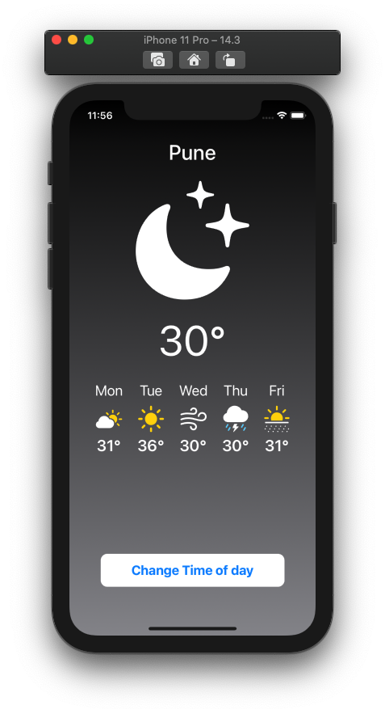

# WeatherSwiftUI
A simple app that demonstrates the use of SwiftUI components
This app is a static screen which demonstrates the use of HStacks, VStacks, Buttons, Images
and an initial introduction to the `@State` property wrapper.

## Requirements
- Xcode 12 or above
- SFSymbols 2.1

